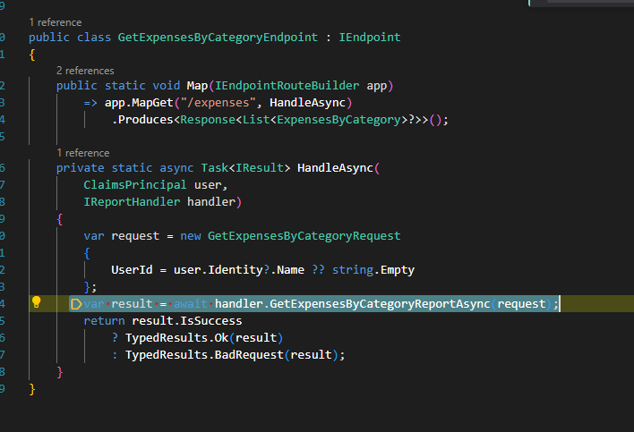
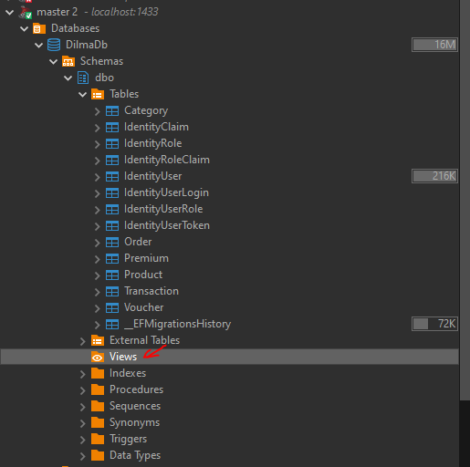
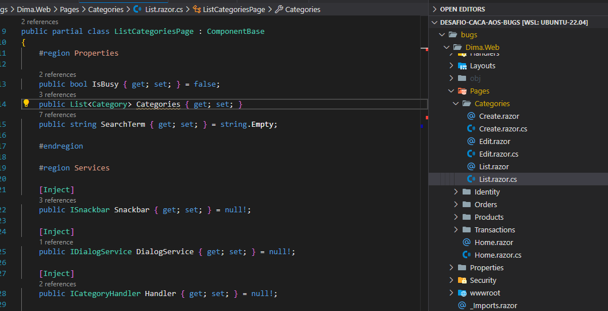
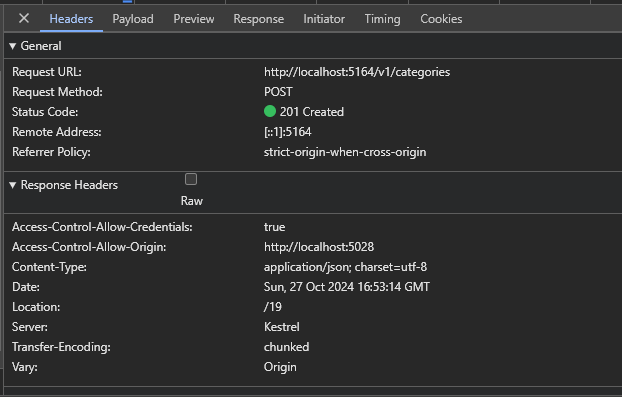
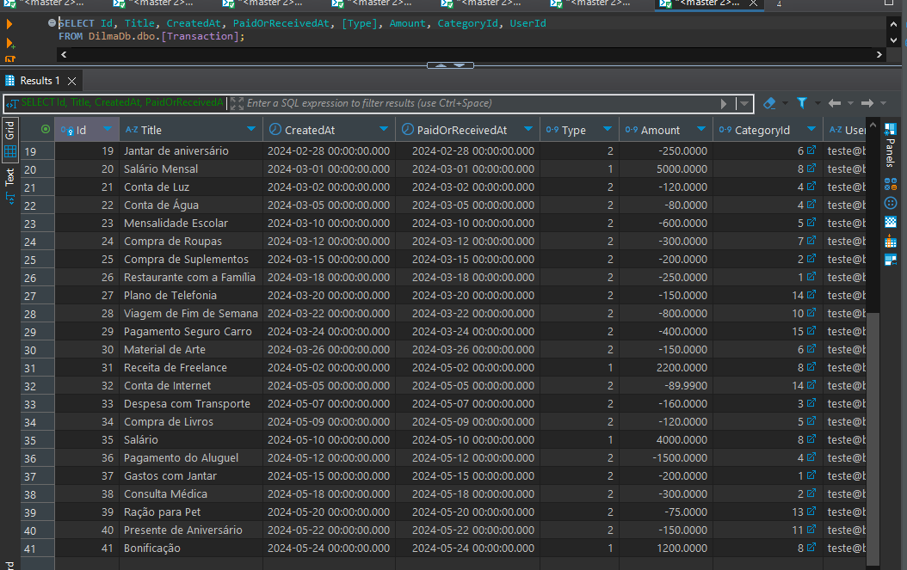
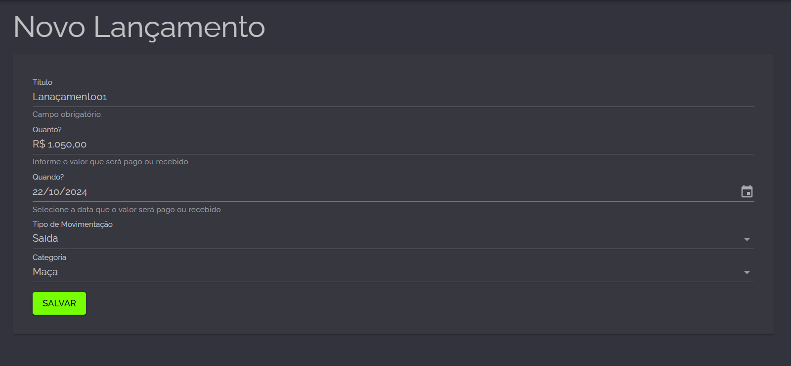
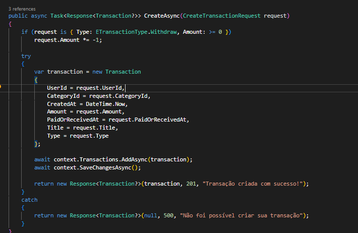
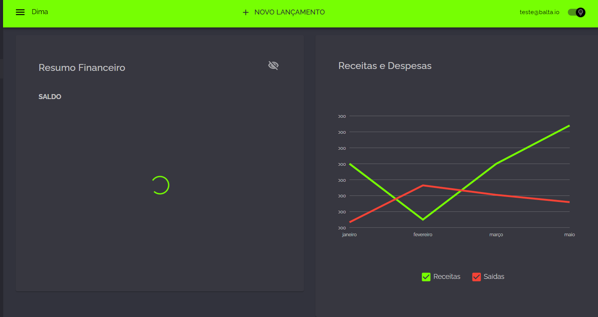
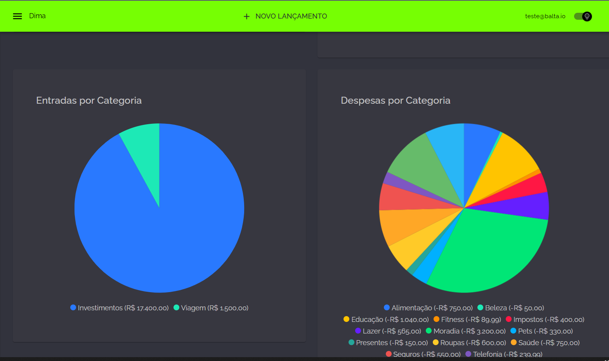

## 🎖️ Desafio
**Caça aos Bugs 2024** é a sexta edição dos **Desafios .NET** realizados pelo [balta.io](https://balta.io). Durante esta jornada, fizemos parte da equipe __NOME_DA_BANDA__ onde resolvemos todos os bugs de uma aplicação e aplicamos testes de unidade no projeto.

## 📱 Projeto
Depuração e solução de bugs, pensamento crítico e analítico, segurança e qualidade de software aplicando testes de unidade.

## Participantes
### 🚀 Líder Técnico
[NOME e GITHUB]

### 👻 Caçadores de Bugs
* [NOME e GITHUB]

## ⚙️ Tecnologias
* C# 12
* .NET 8
* ASP.NET
* Minimal APIs
* Blazor Web Assembly
* xUnit
* [MakeFile](https://www.gnu.org/software/make/#download)
* [Docker](https://docs.docker.com/engine/install/)

## 🥋 Skills Desenvolvidas
* Comunicação
* Trabalho em Equipe
* Networking
* Muito conhecimento técnico


# 💜 Participe
Quer participar dos próximos desafios? Junte-se a [maior comunidade .NET do Brasil 🇧🇷 💜](https://balta.io/discord)

## 🧪 Como testar o projeto

Ele utiliza Docker para facilitar a configuração e oferece um Makefile para agilizar os comandos de inicialização.

#### Utilizando o MakeFile:

```text
cd bugs
make up
make migrations
```

#### Sem utilizar o MakeFile:

```text
cd bugs
docker compose -f docker-compose.yml up -d
docker compose -f docker-compose-migration.yml up --build --abort-on-container-exit
```

Depois de iniciar o projeto entrat no [UI](http://localhost:5028) e criar o usuário com e-mail (teste@balta.io).

```text
email : teste@balta.io
pass  : D1m@D1m@
```

Se quiser mudar o nome do banco é necessário alterar os arquivos:

- init-db.sql
- docker-compose-migratio.yml (ConnectionStrings__DefaultConnection)
- docker-compose.yml (ConnectionStrings__DefaultConnection)

# 🕵️‍♂️ Invetigando os bugs🐞 e coleta de evidências 📖
## 🐞BUG 1 - Erro na Home do App

Após realizado o passo a passo sugerido foi criado o usuário.

```text
email : testedima@email.com
pass  : D1m@D1m@
```

## 🐞BUG 2 - Erro na Home do App

Dentro do sistema, vamos abrir o DevTools (F12) e ir até a aba de Network. Foi possível constatar o bug descrito no `.pdf`.


Agora, vamos fazer o debug do endpoint `expenses`, chegando no método `GetExpensesByReportAsync`.



Continuando o debug desta consulta:


Ao executar, encontramos a exceção.


Investigando dentro da solução, encontramos onde a view está mapeada.


Porém, ao consultar o banco, não encontramos a view.



Analisando o código, vimos que os scripts para criação das views estão disponíveis.


Neste ponto, poderíamos executar os scripts manualmente, mas passar essa responsabilidade para outro dev poderia se tornar um hábito custoso e fácil de esquecer, aumentando o tempo necessário para iniciar a aplicação. Por isso, decidi criar uma nova migration para incluir esses scripts e automatizar o processo.

```bash
dotnet ef migrations add CreateViews
```

E lá vamos nós subir a migration.

```bash
dotnet ef database update 
```


Antes de voltar ao nosso querido debug, notei que havia uma pasta chamada Scripts com um seed.sql. Já que criamos uma migration para as views, por que não criar uma para os seeds também? 😎

```text
🚨🚨🚨🚨 
Em uma aplicação real, existem seeds que PRECISAM estar em produção (por exemplo, tabelas de tipos/types) e outros que servem apenas para desenvolvimento. Por isso, essa ação pode não ser recomendada no dia a dia e deve ser avaliada caso a caso.
🚨🚨🚨🚨 
```

Com esse disclaimer feito, vamos criar a migration para aplicar os seeds.

```bash
dotnet ef migrations add ApplySeeds
```

E lá vamos nós de novo.

```bash
dotnet ef database update 
```

Validando se as migrations foram aplicadas:


Verificando se um dos seeds foi aplicado com sucesso:


Voltando ao DevTools na aba de Network, vimos que não temos mais erros.


E na tela inicial, tudo carregou corretamente.


## 🐞BUG 3 - Categorias não lista

Ao entrar na tela de categorias, recebemos a mensagem de erro descrito no documentos de bugs.

<div style"color=red"> Oject reference not set to an instance of an object.</div>

Ao verificar no DevTools, pode-se verificar que não apresenta nenhum erro.


Então vamos analizar o codigo da tela, e ao abrir a IDE já está apontando um aviso da lista não instanciada.



E outro aviso que pode estar dentando inserir na coleção um objeto que pode estar vazio.


Vamos aplicar a correção de instanciar a lista que é apresentada na tela, e um tratamento para não inserir um objeto vazio e sim um lista vazia.


Agora realizando o teste novamente, pode-se ver que a pela carregou normalmente, borá para o proximo bug que o negócio está ficando quente🔥.


## 🐞 BUG 4 - Erro ao Criar Categoria

Ao tentar replicar o erro de criação de uma categoria, recebemos um erro diferente do descrito, mas vamos atrás da correção!


No projeto Web, vamos verificar o handler de criação. Aqui já chama a atenção o fato de o método HTTP estar como `PUT`. Porém, antes de alterar, vamos conferir a implementação na API.


Verificando a implementação na API, é possível ver que ela está como método HTTP `POST`, o que explica o erro.


Vamos ajustar a implementação para o método HTTP `POST`, que foi o método implementado e é o correto a ser usado por convenção para criação.


Realizando um novo teste de salvamento:



Voltando à tela de listagem, podemos ver que o nosso registro foi criado corretamente.


Trem que pula! Bora gente, só faltam mais dois bugzinhos 🐞 para terminarmos nossa jornada.

## 🐞 BUG 5 - Transação é criada mas não aparece

Agora vamos para a parte de transação. Ao tentar replicar o erro, recebemos a mensagem de que a transação foi salva.


Ao verificar o DevTools, não encontramos nenhum erro ao tentar obter a lista.


Porém, ao checar o banco de dados, vemos que o nosso registro não foi salvo 😨.



Ao abrir o handler de salvamento, a IDE (nossa amiga 😗) já está dando dois warnings indicando operações assíncronas sem o uso de `await`. Bora adicionar o `await` e testar novamente.


Criando uma nova transação... agora vai!



Ops, nossa transação foi salva, mas com o ID de outro usuário 😅. Bom, melhor que nada, né?


Voltando ao código, vamos ajustar para preencher o `userId` corretamente com o ID do usuário da requisição.



E lá vamos nós 🚂, criando outra transação.


Agora a transação aparece na tela, ufa 😁.


Verificando no banco de dados, podemos confirmar que o registro agora está associado ao nosso `userId`.


## 🐞 BUG 6 - Atualização de uma transação não funciona

Chegamos no último chefão! Bora acabar com ele 💪.

Ao tentar editar o registro, somos recebidos com o erro abaixo:


Porém, ao realizar a correção do **BUG 5**, já conseguimos ver que no `TransactionHandler` o `updateAsync` havia sido esquecido de ser implementado. Alguém deve ter se apressado para terminar a User Story 😒. Espero que ainda não tenha passado pelo PR-Review 🙏.


Vamos implementar o código, e sem dar aquele clássico `ctrl+c` e `ctrl+v` do método de categoria, só trocando variáveis e descrição 😅.


Agora, com o método implementado, vamos realizar outro teste de edição.


Aeeeeee! Registro editado com sucesso 🎉.


## PLUS 

Para enriquecer os testes, vamos criar um usuário com vários registros no seed:

```text
email : teste@balta.io
pass  : D1m@D1m@
```

Olha como a tela inicial fica mais rica de informações com esse usuário:



